# Celebrating a milestone

Hey there! I have some truly exciting news to share with you. The team at [Spacemesh](https://spacemesh.io) has successfully launched their mainnet! 🚀 It's an incredible achievement, and I'm genuinely thrilled for them.

The memorable date was July 14th, a day that marked a significant milestone in their journey. It's the result of the Spacemesh team's perseverance and their tireless dedication to their project.

Their commitment to their vision is nothing short of impressive. With the mainnet now operational, the future indeed looks promising for Spacemesh!

# Now what ?

Now that the genesis event is over, we have approximately 10 days to set up our PoST data before the first round begins, as explained in the [genesis timeline](https://spacemesh.io/blog/genesis-timeline/).

Data setup is the computationally intensive part of the Proof of Space and Time algorithm used by Spacemesh.

And it is indeed intensive. While you can generate PoST data on most systems, it operates best with a GPU—a powerful one at that.

However, there's a problem. I don't own a GPU. I only have a MacBook M2, and it's not sufficiently fast for data setup. It's not just slow, but I can't keep it running continuously until it's done, which could take weeks. So, I needed to devise an alternate solution.

# Cloud GPU ?

⚠️ ⚠️ ⚠️

_Before proceeding further, please be aware of the following risks:_

- _You will enter your passphrase in a cloud instance, essentially someone else's computer. This is vulnerable to MITM attacks!_
- _We will use [this](https://github.com/selkies-project/docker-nvidia-glx-desktop) Docker image for our environment, which makes it vulnerable to supply chain attacks!_
- _In essence, you're trusting Runpod to run a virtual machine for you, configured by a GitHub user, with instructions provided by me, and trust that they won't spy on your activities inside that virtual machine and also trust they will delete all the data after you're done._

_Understood the risks? Great, let's continue._

⚠️ ⚠️ ⚠️

Enter [runpod](runpod.io).

Runpod is a platform where you can rent GPU power or offer your own GPU to be used by others. If you're not into the whole community thing, they also have their own GPUs, and their pricing is quite competitive.

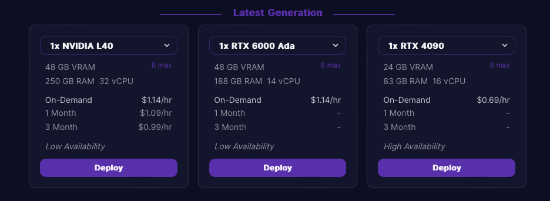

After some very preliminary tests, I discovered that an RTX 4090 can generate approximately 20GB of PoST data per hour.

This means it would cost around $0.03/GB or roughly $30 worth of GPU computing power for each TB.

Remember, this is a very rough estimate. I recommend you to test it out for yourself with the minimum 256GB PoST first.

# The actual guide

- Register for an account on runpod.io. Duh.
- Runpod operates on prepaid credits, so you'll need to add some funds [here](https://www.runpod.io/console/user/billing).

  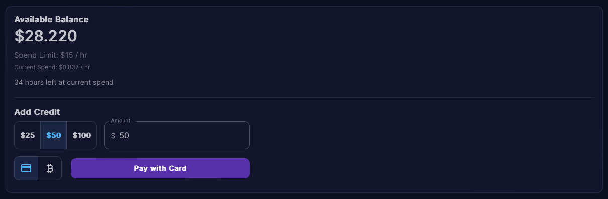

- Create the template which we will use later

  - Under _My Templates_, create a _New Template_ using these settings

    - Template name: whatever name you prefer
    - Container image: **ghcr.io/selkies-project/nvidia-glx-desktop:latest**
    - Container Disk: **5 GB**
    - Volume Disk: **1050GB**

      _This is the size of the volume which will be used for PoST data generation. In this case, we will generate 1TB of data, so this is slightly bigger than that._

    - Volume Mount Path: **/home/user/post**

      _This is the default path that the Spacemesh App uses for PoST data generation. For convenience, we will mount the volume here._

    - Expose HTTP Ports: **8080,**

      _This will be used for our remote connection inside the VM._

    - Expose TCP Ports: **22,**

      _Just in case you need to ssh into it. Not mandatory._

    - Environment Variables

      _These are very important, so ensure you input them correctly. Their order in the table doesn't matter, but the values do!_

      **PASSWD - whatever password you want**

      **NOVNC_ENABLE - true**

      **NVIDIA_DRIVER_CAPABILITIES - all**

Your setup should look something like this once you're finished:

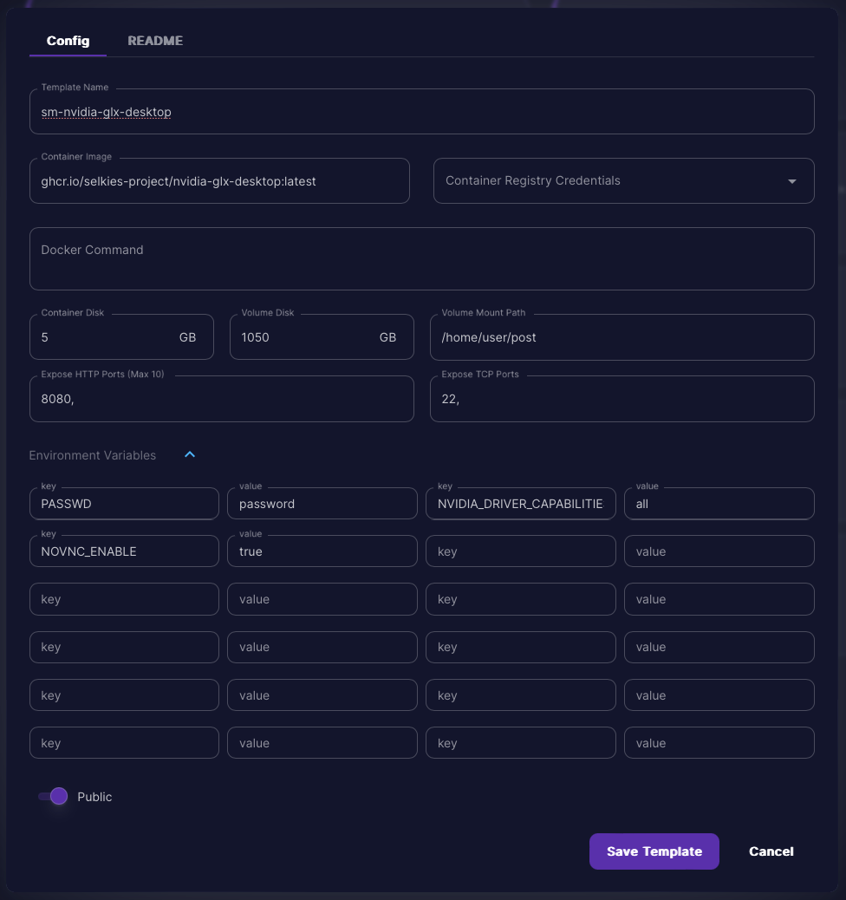

- Save the template. Duh.

- Go to _Secure Cloud_ and _Deploy_ a _RTX 4090_ instance. **Ensure you use the template you created earlier; in my case, _sm-nvidia-glx-desktop_.**

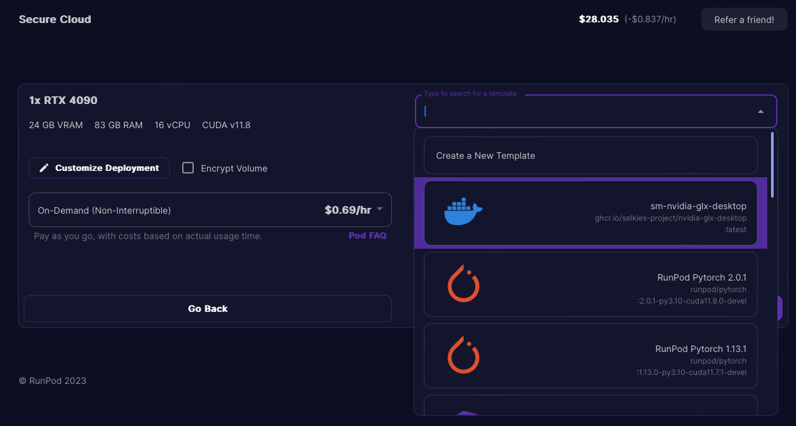

- Start it up but don't touch it yet! Wait for a few minutes for the docker image to install all the drivers it needs, go grab a coffee or something. Come back in 10 minutes.

- Under _My Pods_, expand your running pod and _Connect_.

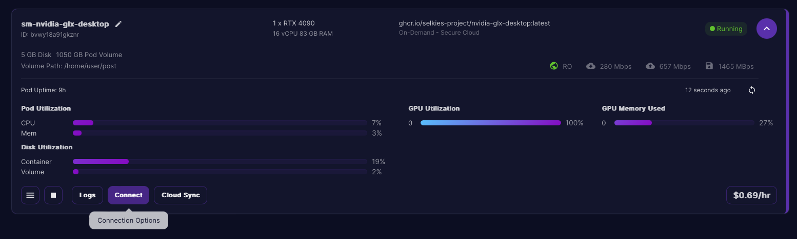

- Choose the _HTTP Service_ option

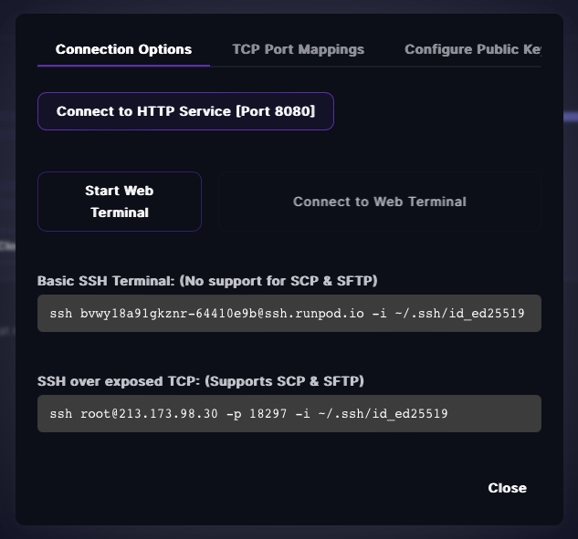

- _noVNC_ will open up in a new tab. Go ahead and enter the password you set for the template.

- You can [download Smapp](https://spacemesh.io/start/) for Linux using Firefox.

- Once it's downloaded, open the KDE menu (the thing which looks like the windows Start menu, with an icon like > ) and open _Konsole_.

- Run the following commands.

```
cd Downloads

sudo chmod +x Sp[tab]
                  ^
Don't actually write "[tab]". Press tab instead. That'll autocomplete the file name.

./ Sp[tab] --no-sandbox
```

This should open Smapp.

- Restore or set up a new account. **Don't forget to write down the passphrase!!!**

- Set up PoST generation. I won't go into details about this. Spacemesh has a guide [here](https://spacemesh.io/start/#spacemesh-app)
  - the default folder - /home/user/post
  - 16 files of 64GB, resulting in 1TB PoST data
  - Nvidia GPU

Data generation will take a long time. It would be a shame if something went wrong and it's not generating it in the right place, right?

- Come back after about 30 minutes, open the file explorer and go to _/Home/post_. You should see something similar to this

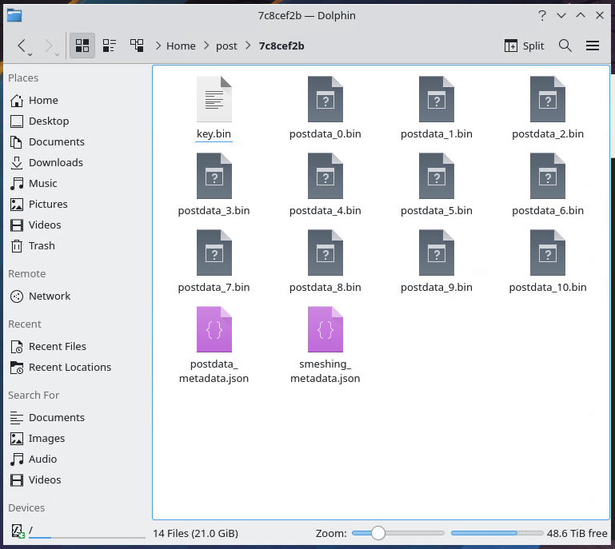

- Let it do its job. It will probably take a couple of days.

_wikka wikka dj cue scratch_ - Ok, we're 2 days later. Our data initialization is done.

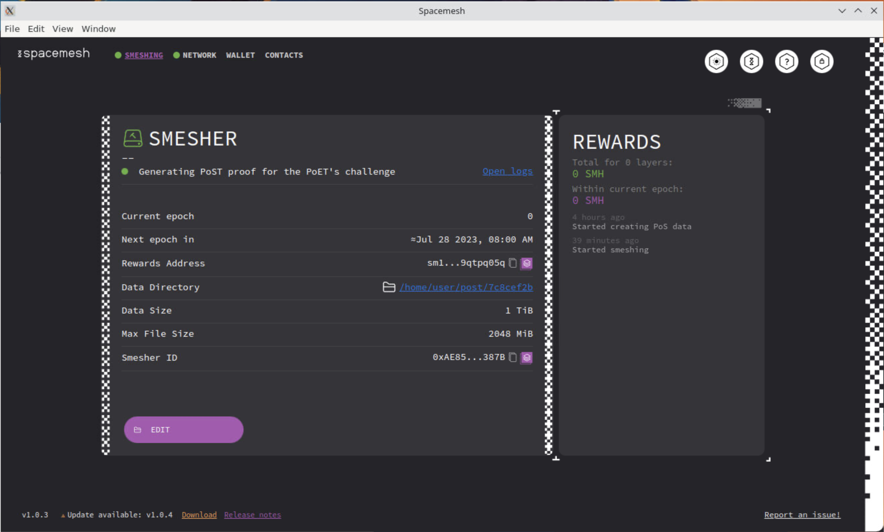

- We now have a bunch of files in _/home/user/post_. And we just ran into another problem. These files are not on our PC, they are still on the GPU server. We need to get them out of there.

I tried transferring them directly. It didn't go well. Apparently those servers limit the bandwidth to pretty much any IP, _except some storage providers_.

This means we have to move the data to a storage provider first, and then download it from there.

I tried using AWS S3 for a 256GB transfer. It ended up costing around 20$, which I believe is too expensive, so for this guide we will use [BackBlaze](https://www.backblaze.com) instead.

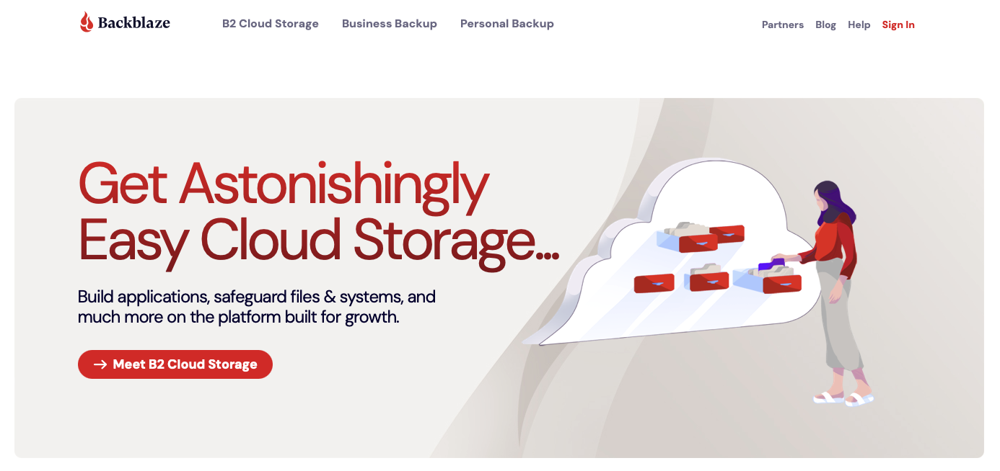

- So... create an account on Backblaze. Duh.

- Nothing in the world is free, so make sure to enter your billing info.

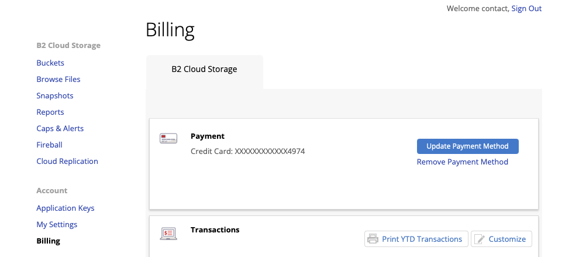

- In order to connect our server to backblaze we will need to generate an API key for it. You can do that inside the main dashboard.

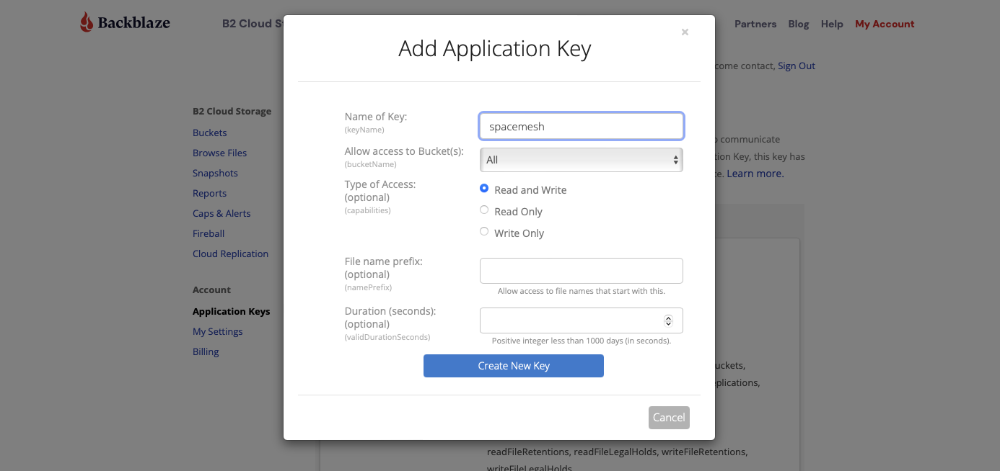

- Backbalze will give you some keys to access your storage. Copy these in a text file or something, you will need them later.

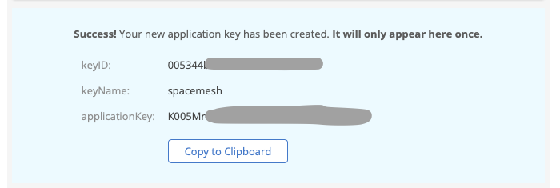

- Besides a way to access Backblaze, we need an actual _place_ inside Backblaze to storage the data. This is called a bucket. It works sort of like a folder. Go ahead and create one.

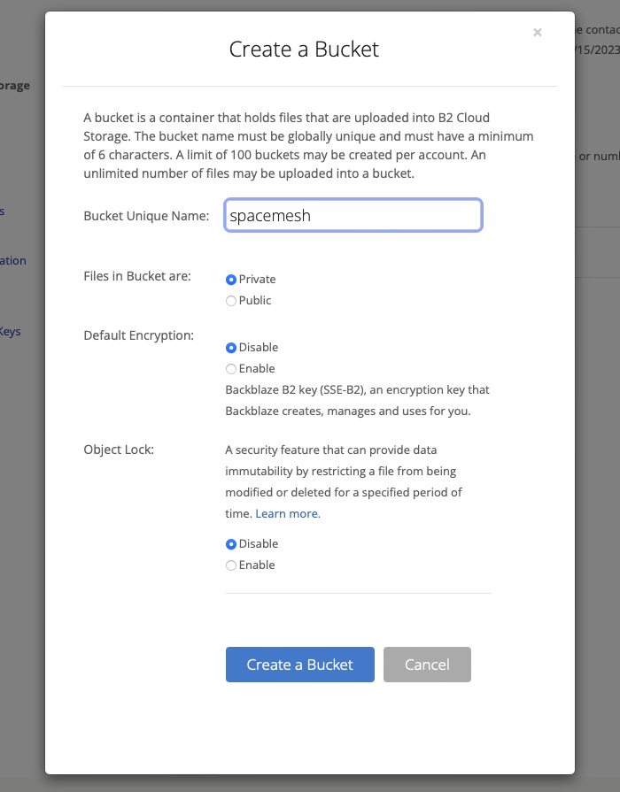

- Cool, Backblaze is done. We can start moving our data. Go back to your runpod instance and click _Cloud sync_. A few options will show up. Select _Backblaze_ and click on _Copy **to** Backblaze_

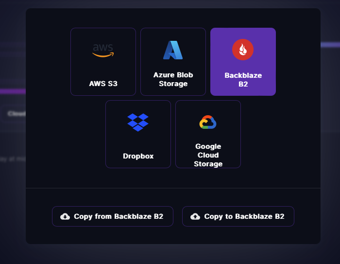

- You now need to enter the information you got from Backblaze.

  - Account ID or Application Key ID - enter keyID from Backblaze here
  - Application Key - enter applicationKey from Backblaze here
  - Bucket Path - enter the bucket name here
  - Copy from Pod - this should default to `/home/user/post`. If that's the case, leave it as is.

- Runpod might complain there was an error. Actually, there's no error. Wait for a minute, click on Cloud Sync again and you should be able to see progress by clicking on _Debug_

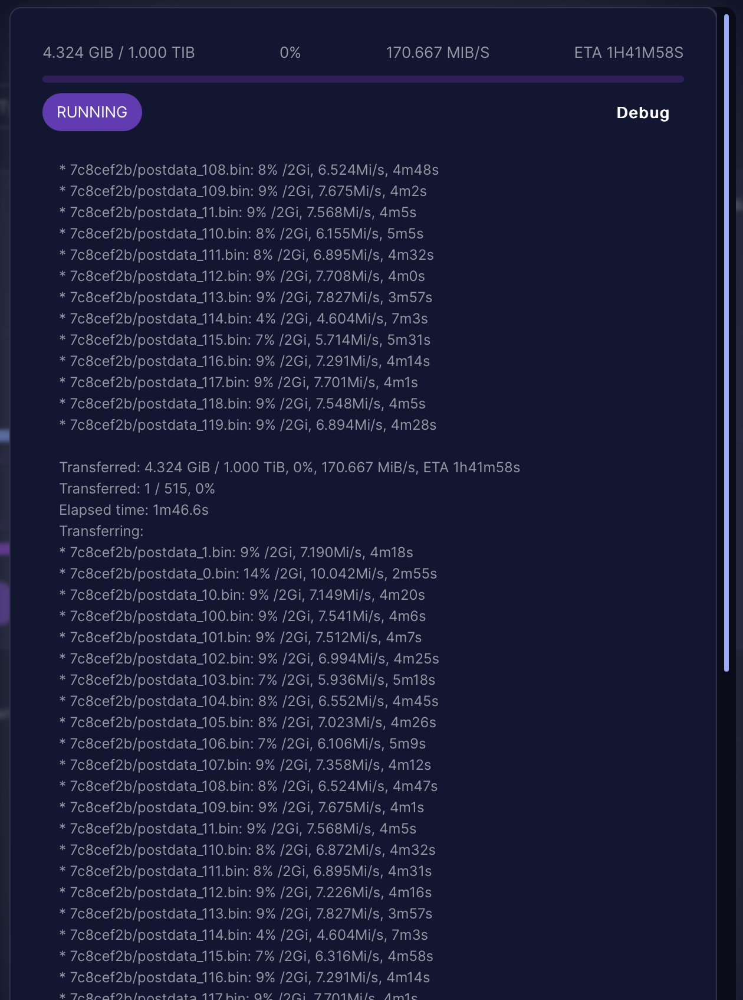

- It should be quite fast. I moved 1TB in around 15 minutes.

- Once the transfer is done, select all your files in the File Browser and click Download. It won't actually start the download, but instead it will ask you to create a snapshot of the data first. You will be able to download this snapshot later.

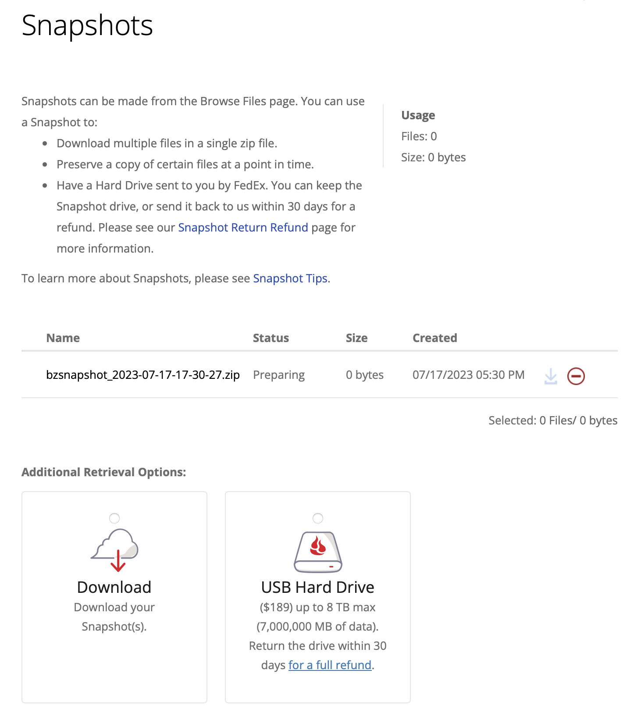

- When the snapshot is ready, download it, set up your local node and start smeshing!

_Make sure you don't forget to stop and delete the runpod instance and delete all the data from Backblaze, otherwise you will keep paying for it._
