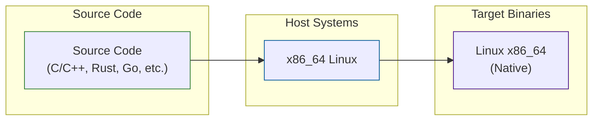
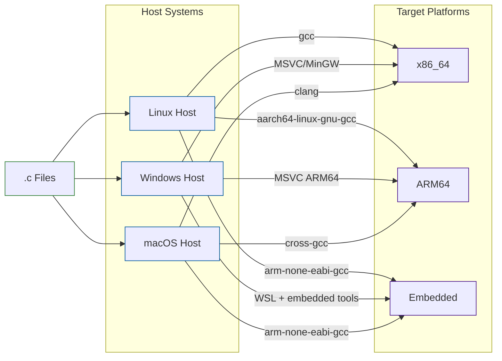
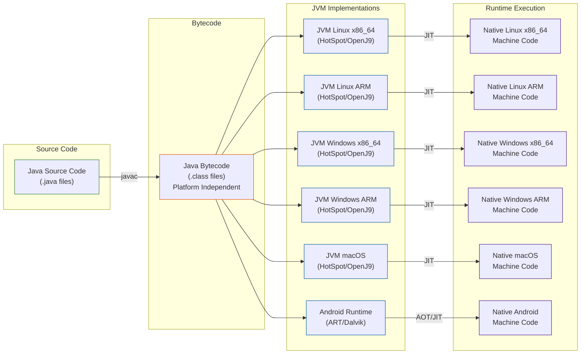
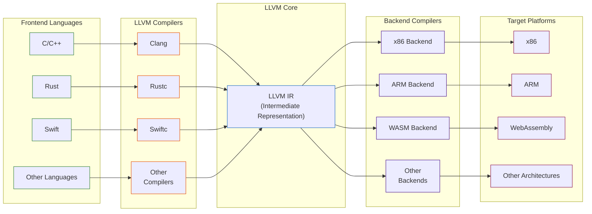
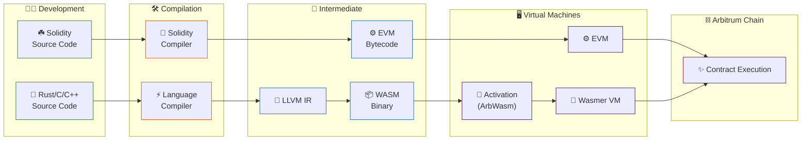
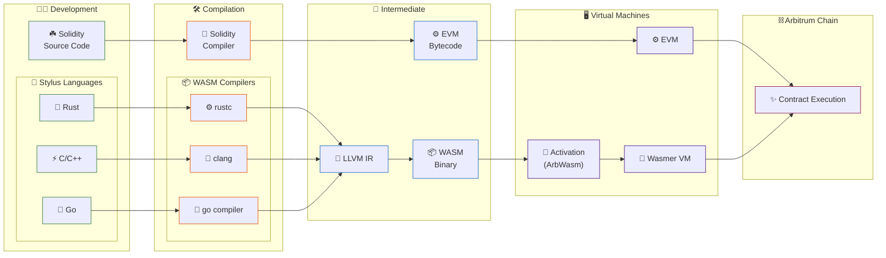
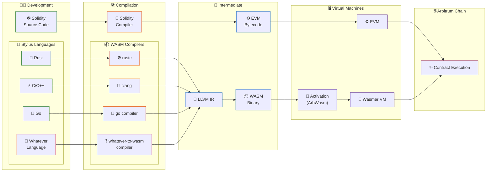
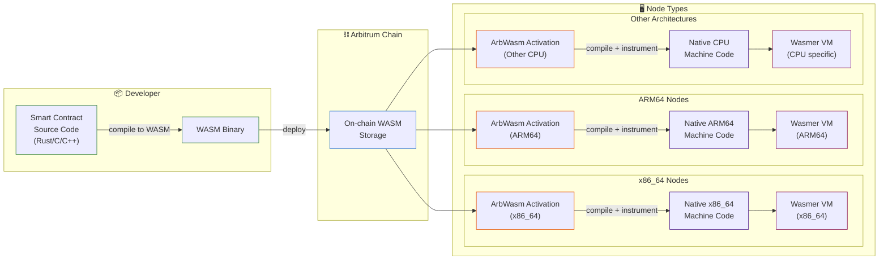
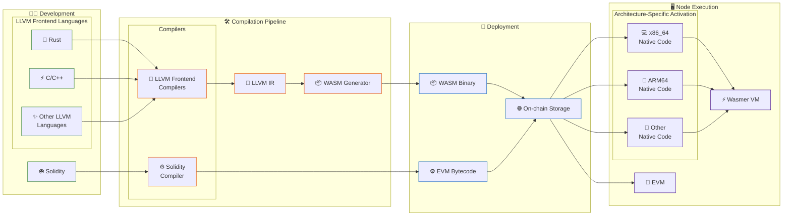

## Arbitrum Stylus

decentralized software using modern languages

---

## But first...

### Any idea what this is?

```binary
00008000: 0000 0000 2000 0000 5000 0000 5800 0000  .... ...P...X...
00008010: 0100 0000 0100 0000 0000 0000 0000 0000  ................
00008020: 0400 0000 0000 0000 0000 0000 1800 0000  ................
00008030: 0000 0000 0000 0000 1800 0000 0040 0600  .............@..
00008040: 0040 0000 0000 0000 0000 0000 0100 0000  .@..............
00008050: 0102 0000 0000 0000 005f 7075 7473 0000  ........._puts..
00008060: 0001 5f00 1200 0000 0002 0000 0003 00ec  .._.............
00008070: 7e00 0002 5f6d 685f 6578 6563 7574 655f  ~..._mh_execute_
00008080: 6865 6164 6572 0009 6d61 696e 000d 0000  header..main....
00008090: ec7e 0000 0000 0000 0200 0000 0f01 1000  .~..............
000080a0: 0000 0000 0100 0000 1600 0000 0f01 0000  ................
000080b0: 6c3f 0000 0100 0000 1c00 0000 0100 0001  l?..............
000080c0: 0000 0000 0000 0000 0200 0000 0200 0000  ................
000080d0: 2000 5f5f 6d68 5f65 7865 6375 7465 5f68   .__mh_execute_h
000080e0: 6561 6465 7200 5f6d 6169 6e00 5f70 7574  eader._main._put
000080f0: 7300 0000 0000 0000 0000 0000 0000 0000  s...............
00008100: fade 0cc0 0000 0190 0000 0001 0000 0000  ................
00008110: 0000 0014 fade 0c02 0000 017c 0002 0400  ...........|....
00008120: 0002 0002 0000 005c 0000 0058 0000 0000  .......\...X....
00008130: 0000 0009 0000 8100 2002 000c 0000 0000  ........ .......
00008140: 0000 0000 0000 0000 0000 0000 0000 0000  ................
00008150: 0000 0000 0000 0000 0000 0000 0000 0000  ................
00008160: 0000 0020 0000 0000 0000 0001 6269 6e00  ... ........bin.
00008170: b10e 396b 300e c059 ff07 230f 04ff 9612  ..9k0..Y..#.....
00008180: 0cf6 ad69 c72b 3750 d635 743c 6fdd 7795  ...i.+7P.5t<o.w.
00008190: ad7f acb2 586f c6e9 66c0 04d7 d1d1 6b02  ....Xo..f.....k.
000081a0: 4f58 05ff 7cb4 7c7a 85da bd8b 4889 2ca7  OX..|.|z....H.,.
000081b0: ad7f acb2 586f c6e9 66c0 04d7 d1d1 6b02  ....Xo..f.....k.
000081c0: 4f58 05ff 7cb4 7c7a 85da bd8b 4889 2ca7  OX..|.|z....H.,.
000081d0: b16a 9851 c156 6bf8 9937 b69b e82f bc76  .j.Q.Vk..7.../.v
000081e0: 25a1 e9d9 e049 e1f1 4475 1e0c f114 013c  %....I..Du.....<
000081f0: dfd5 eb86 f195 6603 a12c 0636 f463 1f66  ......f..,.6.c.f
00008200: f10d 0bb8 d4ee a3d2 5b82 e0e5 9202 b4ed  ........[.......
00008210: ad7f acb2 586f c6e9 66c0 04d7 d1d1 6b02  ....Xo..f.....k.
00008220: 4f58 05ff 7cb4 7c7a 85da bd8b 4889 2ca7  OX..|.|z....H.,.
00008230: ad7f acb2 586f c6e9 66c0 04d7 d1d1 6b02  ....Xo..f.....k.
00008240: 4f58 05ff 7cb4 7c7a 85da bd8b 4889 2ca7  OX..|.|z....H.,.
00008250: ad7f acb2 586f c6e9 66c0 04d7 d1d1 6b02  ....Xo..f.....k.
00008260: 4f58 05ff 7cb4 7c7a 85da bd8b 4889 2ca7  OX..|.|z....H.,.
00008270: ef44 8c65 7c31 da00 4d03 3b05 21d0 471d  .D.e|1..M.;.!.G.
00008280: f7e4 3d8c 694e 53f4 06d0 c101 0a6d cc5d  ..=.iNS......m.]
```

---

## This?

```asm
; Text section contains code
.section .text
.globl _main        ; Make main function visible to linker

_main:
   ; Function prologue - set up stack frame
   stp x29, x30, [sp, #-16]!   ; Save frame pointer and link register
   mov x29, sp                 ; Set frame pointer to stack pointer

   ; Load string address and call puts
   adrp x0, l_str@PAGE         ; Get page address of string
   add x0, x0, l_str@PAGEOFF   ; Add offset to get exact string address
   bl _puts                    ; Call puts function to print string

   ; Return 0 to indicate success
   mov w0, #0                  ; Set return value to 0

   ; Function epilogue - restore stack and return
   ldp x29, x30, [sp], #16     ; Restore saved registers
   ret                         ; Return from main

; Data section contains string constant
.section .cstring
l_str:
   .asciz "Hello, Stylus!"     ; Null-terminated string
```

---

# How about this?

```c
#include <stdio.h>

int main() {

    printf("Hello, Stylus!\n");

    return 0;

}
```


---

# C

It began in the 70s and became the default programming language in the 80s thanks to UNIX.

---

## This was programming for a while

```c
static int cpuhp_invoke_callback(unsigned int cpu, enum cpuhp_state state,
				 bool bringup, struct hlist_node *node,
				 struct hlist_node **lastp)
{
	struct cpuhp_cpu_state *st = per_cpu_ptr(&cpuhp_state, cpu);
	struct cpuhp_step *step = cpuhp_get_step(state);
	int (*cbm)(unsigned int cpu, struct hlist_node *node);
	int (*cb)(unsigned int cpu);
	int ret, cnt;

	if (st->fail == state) {
		st->fail = CPUHP_INVALID;
		return -EAGAIN;
	}

	if (cpuhp_step_empty(bringup, step)) {
		WARN_ON_ONCE(1);
		return 0;
	}

	if (!step->multi_instance) {
		WARN_ON_ONCE(lastp && *lastp);
		cb = bringup ? step->startup.single : step->teardown.single;

		trace_cpuhp_enter(cpu, st->target, state, cb);
		ret = cb(cpu);
		trace_cpuhp_exit(cpu, st->state, state, ret);
		return ret;
	}
	cbm = bringup ? step->startup.multi : step->teardown.multi;

	/* Single invocation for instance add/remove */
	if (node) {
		WARN_ON_ONCE(lastp && *lastp);
		trace_cpuhp_multi_enter(cpu, st->target, state, cbm, node);
		ret = cbm(cpu, node);
		trace_cpuhp_exit(cpu, st->state, state, ret);
		return ret;
	}

	/* State transition. Invoke on all instances */
	cnt = 0;
	hlist_for_each(node, &step->list) {
		if (lastp && node == *lastp)
			break;

		trace_cpuhp_multi_enter(cpu, st->target, state, cbm, node);
		ret = cbm(cpu, node);
		trace_cpuhp_exit(cpu, st->state, state, ret);
		if (ret) {
			if (!lastp)
				goto err;

			*lastp = node;
			return ret;
		}
		cnt++;
	}
	if (lastp)
		*lastp = NULL;
	return 0;
err:
	/* Rollback the instances if one failed */
	cbm = !bringup ? step->startup.multi : step->teardown.multi;
	if (!cbm)
		return ret;

	hlist_for_each(node, &step->list) {
		if (!cnt--)
			break;

		trace_cpuhp_multi_enter(cpu, st->target, state, cbm, node);
		ret = cbm(cpu, node);
		trace_cpuhp_exit(cpu, st->state, state, ret);
		/*
		 * Rollback must not fail,
		 */
		WARN_ON_ONCE(ret);
	}
	return ret;
}
```

---

### code -> compile -> execute

---



---




---

## But then, in 1995


---


---

## Java became popular because of

## write once, run everywhere

---




---

# Two paradigms

### Cross compilation
### Virtual environment


---


## Decoupling compilation from execution


#### keep that in mind for a sec...

---

## but anyway,

## back to blockchain


```binary
00000000  60 80 60 40 52 60 40 51 80 60 40 01 60 40 52 80  |`.`@R`@Q.`@.`@R.|
00000010  60 0f 81 52 60 20 01 7f 48 65 6c 6c 6f 2c 20 53  |`..R` ..Hello, S|
00000020  6f 6c 69 64 69 74 79 00 00 00 00 00 00 00 00 00  |olidity.........|
00000030  00 00 00 00 00 00 00 00 81 52 50 5f 90 81 61 00  |.........RP_..a.|
00000040  47 91 90 61 02 93 56 5b 50 34 80 15 61 00 53 57  |G..a..V[P4..a.SW|
00000050  5f 80 fd 5b 50 61 03 62 56 5b 5f 81 51 90 50 91  |_.ý[Pa.bV[_.Q.P.|
00000060  90 50 56 5b 7f 4e 48 7b 71 00 00 00 00 00 00 00  |.PV[.NH{q.......|
00000070  00 00 00 00 00 00 00 00 00 00 00 00 00 00 00 00  |................|
00000080  00 00 00 00 00 5f 52 60 41 60 04 52 60 24 5f fd  |....._R`A`.R`$_ý|
00000090  5b 7f 4e 48 7b 71 00 00 00 00 00 00 00 00 00 00  |[.NH{q..........|
000000a0  00 00 00 00 00 00 00 00 00 00 00 00 00 00 00 00  |................|
000000b0  00 00 5f 52 60 22 60 04 52 60 24 5f fd 5b 5f 60  |.._R`"`.R`$_ý[_`|
000000c0  02 82 04 90 50 60 01 82 16 80 61 00 d4 57 60 7f  |....P`....a.ÔW`.|
000000d0  82 16 91 50 5b 60 20 82 10 81 03 61 00 e7 57 61  |...P[` ....a.çWa|
000000e0  00 e6 61 00 90 56 5b 5b 50 91 90 50 56 5b 5f 81  |.æa..V[[P..PV[_.|
000000f0  90 50 81 5f 52 60 20 5f 20 90 50 91 90 50 56 5b  |.P._R` _ .P..PV[|
00000100  5f 60 20 60 1f 83 01 04 90 50 91 90 50 56 5b 5f  |_` `.....P..PV[_|
00000110  82 82 1b 90 50 92 91 50 50 56 5b 5f 60 08 83 02  |....P..PPV[_`...|
00000120  61 01 49 7f ff ff ff ff ff ff ff ff ff ff ff ff  |a.I.ÿÿÿÿÿÿÿÿÿÿÿÿ|
00000130  ff ff ff ff ff ff ff ff ff ff ff ff ff ff ff ff  |ÿÿÿÿÿÿÿÿÿÿÿÿÿÿÿÿ|
00000140  ff ff ff ff 82 61 01 0e 56 5b 61 01 53 86 83 61  |ÿÿÿÿ.a..V[a.S..a|
00000150  01 0e 56 5b 95 50 80 19 84 16 93 50 80 86 16 84  |..V[.P.....P....|
00000160  17 92 50 50 50 93 92 50 50 50 56 5b 5f 81 90 50  |..PPP..PPPV[_..P|
00000170  91 90 50 56 5b 5f 81 90 50 91 90 50 56 5b 5f 61  |..PV[_..P..PV[_a|
00000180  01 97 61 01 92 61 01 8d 84 61 01 6b 56 5b 61 01  |..a..a...a.kV[a.|
00000190  74 56 5b 61 01 6b 56 5b 90 50 91 90 50 56 5b 5f  |tV[a.kV[.P..PV[_|
000001a0  81 90 50 91 90 50 56 5b 61 01 b0 83 61 01 7d 56  |..P..PV[a.°.a.}V|
000001b0  5b 61 01 c4 61 01 bc 82 61 01 9e 56 5b 84 84 54  |[a.Äa.¼.a..V[..T|
000001c0  61 01 1a 56 5b 82 55 50 50 50 50 56 5b 5f 90 56  |a..V[.UPPPPV[_.V|
000001d0  5b 61 01 d8 61 01 cc 56 5b 61 01 e3 81 84 84 61  |[a.Øa.ÌV[a.ã...a|
000001e0  01 a7 56 5b 50 50 50 56 5b 5b 81 81 10 15 61 02  |.§V[PPPV[[....a.|
000001f0  06 57 61 01 fb 5f 82 61 01 d0 56 5b 60 01 81 01  |.Wa.û_.a.ÐV[`...|
00000200  90 50 61 01 e9 56 5b 50 50 56 5b 60 1f 82 11 15  |.Pa.éV[PPV[`....|
00000210  61 02 4b 57 61 02 1c 81 61 00 ed 56 5b 61 02 25  |a.KWa...a.íV[a.%|
00000220  84 61 00 ff 56 5b 81 01 60 20 85 10 15 61 02 34  |.a.ÿV[..` ...a.4|
00000230  57 81 90 50 5b 61 02 48 61 02 40 85 61 00 ff 56  |W..P[a.Ha.@.a.ÿV|
00000240  5b 83 01 82 61 01 e8 56 5b 50 50 5b 50 50 50 56  |[...a.èV[PP[PPPV|
00000250  5b 5f 82 82 1c 90 50 92 91 50 50 56 5b 5f 61 02  |[_....P..PPV[_a.|
00000260  6b 5f 19 84 60 08 02 61 02 50 56 5b 19 80 83 16  |k_..`..a.PV[....|
00000270  91 50 50 92 91 50 50 56 5b 5f 61 02 83 83 83 61  |.PP..PPV[_a....a|
00000280  02 5c 56 5b 91 50 82 60 02 02 82 17 90 50 92 91  |.\V[.P.`.....P..|
00000290  50 50 56 5b 61 02 9c 82 61 00 59 56 5b 67 ff ff  |PPV[a...a.YV[gÿÿ|
000002a0  ff ff ff ff ff ff 81 11 15 61 02 b5 57 61 02 b4  |ÿÿÿÿÿÿ...a.µWa.´|
000002b0  61 00 63 56 5b 5b 61 02 bf 82 54 61 00 bd 56 5b  |a.cV[[a.¿.Ta.½V[|
000002c0  61 02 ca 82 82 85 61 02 0a 56 5b 5f 60 20 90 50  |a.Ê...a..V[_` .P|
000002d0  60 1f 83 11 60 01 81 14 61 02 fb 57 5f 84 15 61  |`...`...a.ûW_..a|
000002e0  02 e9 57 82 87 01 51 90 50 5b 61 02 f3 85 82 61  |.éW...Q.P[a.ó..a|
000002f0  02 78 56 5b 86 55 50 61 03 5a 56 5b 60 1f 19 84  |.xV[.UPa.ZV[`...|
00000300  16 61 03 09 86 61 00 ed 56 5b 5f 5b 82 81 10 15  |.a...a.íV[_[....|
00000310  61 03 30 57 84 89 01 51 82 55 60 01 82 01 91 50  |a.0W...Q.U`....P|
00000320  60 20 85 01 94 50 60 20 81 01 90 50 61 03 0b 56  |` ...P` ...Pa..V|
00000330  5b 86 83 10 15 61 03 4d 57 84 89 01 51 61 03 49  |[....a.MW...Qa.I|
00000340  60 1f 89 16 82 61 02 5c 56 5b 83 55 50 5b 60 01  |`....a.\V[.UP[`.|
00000350  60 02 88 02 01 88 55 50 50 50 5b 50 50 50 50 50  |`.....UPPP[PPPPP|
00000360  50 56 5b 61 01 fd 80 61 03 6f 5f 39 5f f3 fe 60  |PV[a.ý.a.o_9_óþ`|
00000370  80 60 40 52 34 80 15 61 00 0f 57 5f 80 fd 5b 50  |.`@R4..a..W_.ý[P|
00000380  60 04 36 10 61 00 29 57 5f 35 60 e0 1c 80 63 ce  |`.6.a.)W_5`à..cÎ|
00000390  6d 41 de 14 61 00 2d 57 5b 5f 80 fd 5b 61 00 35  |mAÞ.a.-W[_.ý[a.5|
000003a0  61 00 4b 56 5b 60 40 51 61 00 42 91 90 61 01 4a  |a.KV[`@Qa.B..a.J|
000003b0  56 5b 60 40 51 80 91 03 90 f3 5b 60 60 5f 80 54  |V[`@Q....ó[``_.T|
000003c0  61 00 59 90 61 01 97 56 5b 80 60 1f 01 60 20 80  |a.Y.a..V[.`..` .|
000003d0  91 04 02 60 20 01 60 40 51 90 81 01 60 40 52 80  |...` .`@Q...`@R.|
000003e0  92 91 90 81 81 52 60 20 01 82 80 54 61 00 85 90  |.....R` ...Ta...|
000003f0  61 01 97 56 5b 80 15 61 00 d0 57 80 60 1f 10 61  |a..V[..a.ÐW.`..a|
00000400  00 a7 57 61 01 00 80 83 54 04 02 83 52 91 60 20  |.§Wa....T...R.` |
00000410  01 91 61 00 d0 56 5b 82 01 91 90 5f 52 60 20 5f  |..a.ÐV[...._R` _|
00000420  20 90 5b 81 54 81 52 90 60 01 01 90 60 20 01 80  | .[.T.R.`...` ..|
00000430  83 11 61 00 b3 57 82 90 03 60 1f 16 82 01 91 5b  |..a.³W...`.....[|
00000440  50 50 50 50 50 90 50 90 56 5b 5f 81 51 90 50 91  |PPPPP.P.V[_.Q.P.|
00000450  90 50 56 5b 5f 82 82 52 60 20 82 01 90 50 92 91  |.PV[_..R` ...P..|
00000460  50 50 56 5b 82 81 83 5e 5f 83 83 01 52 50 50 50  |PPV[...^_...RPPP|
00000470  56 5b 5f 60 1f 19 60 1f 83 01 16 90 50 91 90 50  |V[_`..`.....P..P|
00000480  56 5b 5f 61 01 1c 82 61 00 da 56 5b 61 01 26 81  |V[_a...a.ÚV[a.&.|
00000490  85 61 00 e4 56 5b 93 50 61 01 36 81 85 60 20 86  |.a.äV[.Pa.6..` .|
000004a0  01 61 00 f4 56 5b 61 01 3f 81 61 01 02 56 5b 84  |.a.ôV[a.?.a..V[.|
000004b0  01 91 50 50 92 91 50 50 56 5b 5f 60 20 82 01 90  |..PP..PPV[_` ...|
000004c0  50 81 81 03 5f 83 01 52 61 01 62 81 84 61 01 12  |P..._..Ra.b..a..|
000004d0  56 5b 90 50 92 91 50 50 56 5b 7f 4e 48 7b 71 00  |V[.P..PPV[.NH{q.|
000004e0  00 00 00 00 00 00 00 00 00 00 00 00 00 00 00 00  |................|
000004f0  00 00 00 00 00 00 00 00 00 00 00 5f 52 60 22 60  |..........._R`"`|
00000500  04 52 60 24 5f fd 5b 5f 60 02 82 04 90 50 60 01  |.R`$_ý[_`....P`.|
00000510  82 16 80 61 01 ae 57 60 7f 82 16 91 50 5b 60 20  |...a.®W`....P[` |
00000520  82 10 81 03 61 01 c1 57 61 01 c0 61 01 6a 56 5b  |....a.ÁWa.Àa.jV[|
00000530  5b 50 91 90 50 56 fe a2 64 69 70 66 73 58 22 12  |[P..PVþ¢dipfsX".|
00000540  20 5e 27 d0 0e b8 73 09 e2 97 7f e5 06 8e 04 96  | ^'Ð.¸s.â..å....|
00000550  bd 2b 62 78 09 03 3d 6a 2f ab 19 7b 5f 5a f7 49  |½+bx..=j/«.{_Z÷I|
00000560  24 64 73 6f 6c 63 43 00 08 1a 00 33              |$dsolcC....3|
```

---

## Or this?

```
0000 PUSH1 0x80 - 
0002 PUSH1 0x40 - 
0004 MSTORE 0x - 
0005 PUSH1 0x40 - 
0007 MLOAD 0x - 
0008 DUP1 0x - 
0009 PUSH1 0x40 - 
0011 ADD 0x - 
0012 PUSH1 0x40 - 
0014 MSTORE 0x - 
0015 DUP1 0x - 
0016 PUSH1 0x0f - 
0018 DUP2 0x - 
0019 MSTORE 0x - 
0020 PUSH1 0x20 - 
0022 ADD 0x - 
0023 PUSH32 0x48656c6c6f2c20536f6c69646974790000000000000000000000000000000000 - 
0056 DUP2 0x - 
0057 MSTORE 0x - 
0058 POP 0x - 
0059 PUSH0 0x - 
0060 SWAP1 0x - 
0061 DUP2 0x - 
0062 PUSH2 0x0047 - 
0065 SWAP2 0x - 
0066 SWAP1 0x - 
0067 PUSH2 0x0293 - 
0070 JUMP 0x - 
0071 JUMPDEST 0x - 
0072 POP 0x - 
0073 CALLVALUE 0x - 
0074 DUP1 0x - 
0075 ISZERO 0x - 
0076 PUSH2 0x0053 - 
0079 JUMPI 0x - 
0080 PUSH0 0x - 
0081 DUP1 0x - 
0082 REVERT 0x - 
0083 JUMPDEST 0x - 
0084 POP 0x - 
0085 PUSH2 0x0362 - 
0088 JUMP 0x - 
0089 JUMPDEST 0x - 
0090 PUSH0 0x - 
0091 DUP2 0x - 
0092 MLOAD 0x - 
0093 SWAP1 0x - 
0094 POP 0x - 
0095 SWAP2 0x - 
0096 SWAP1 0x - 
0097 POP 0x - 
0098 JUMP 0x - 
0099 JUMPDEST 0x - 
0100 PUSH32 0x4e487b7100000000000000000000000000000000000000000000000000000000 - 
0133 PUSH0 0x - 
0134 MSTORE 0x - 
0135 PUSH1 0x41 - 
0137 PUSH1 0x04 - 
0139 MSTORE 0x - 
0140 PUSH1 0x24 - 
0142 PUSH0 0x - 
0143 REVERT 0x - 
0144 JUMPDEST 0x - 
0145 PUSH32 0x4e487b7100000000000000000000000000000000000000000000000000000000 - 
0178 PUSH0 0x - 
0179 MSTORE 0x - 
0180 PUSH1 0x22 - 
0182 PUSH1 0x04 - 
0184 MSTORE 0x - 
0185 PUSH1 0x24 - 
0187 PUSH0 0x - 
0188 REVERT 0x - 
0189 JUMPDEST 0x - 
0190 PUSH0 0x - 
0191 PUSH1 0x02 - 
0193 DUP3 0x - 
0194 DIV 0x - 
0195 SWAP1 0x - 
0196 POP 0x - 
0197 PUSH1 0x01 - 
0199 DUP3 0x - 
0200 AND 0x - 
0201 DUP1 0x - 
0202 PUSH2 0x00d4 - 
0205 JUMPI 0x - 
0206 PUSH1 0x7f - 
0208 DUP3 0x - 
0209 AND 0x - 
0210 SWAP2 0x - 
0211 POP 0x - 
0212 JUMPDEST 0x - 
0213 PUSH1 0x20 - 
0215 DUP3 0x - 
0216 LT 0x - 
0217 DUP2 0x - 
0218 SUB 0x - 
0219 PUSH2 0x00e7 - 
0222 JUMPI 0x - 
0223 PUSH2 0x00e6 - 
0226 PUSH2 0x0090 -
```


---

# You can probably guess where this is going


---

```solidity
// SPDX-License-Identifier: GPL-3.0
pragma solidity ^0.8.0;

contract HelloWorld {
	string private message = "Hello, Solidity";

	function getMessage() public view returns (string memory) {
		return message;
	}
}
```

---


---

## Solidity era &asymp; Java era

---


---

## LLVM enters the chat

---



---

## The LLVM-Powered Cambrian Explosion 🧬


---


| System Languages        | Web & Functional        | Emerging & Experimental    |
|------------------------|-------------------------|---------------------------|
| 🦀 Rust (2015)         | 💜 Gleam (2019)         | ⚡ Vale (2020)             |
| 🔷 Swift (2014)        | 💧 Elixir (2012)        | 💠 Mojo (2023)             |
| 🎯 Zig (2016)         | 💎 Crystal (2014)       | 🎨 Dora (2022)             |
| 🌱 Carbon (2022)       | ⚛️ Reason (2016)        | 🔮 Verona (2019)           |
| 🛠️ C++ (Clang)        | 🎭 OCaml (LLVM)         | 🌀 Koka (2014)             |
| 🎲 Julia (2012)        | 🌟 Grain (2020)         | 🎪 Odin (2016)             |
| 🔨 Ada (LLVM GNAT)     | 🎪 Unison (2018)        | 🎯 V (2019)                |


---


---





---




---




---


### What is this WASM thing?


---




---

### Best of both worlds

#### ✅ Any LLVM frontend language
<small> _* in theory, currently only Rust and maybe C_ </small>
#### ✅ Write once, run everywhere
<small> _* in theory, the node software is probably only x86_64 and arm64_ </small>
#### ✅ LLVM intermediate representation
#### ✅ Single WASM Binary
#### ✅ Architecture specific Wasmer Runtime
<small> _* again, in theory_ </small>

---

### Putting it all together





---


## See you at the workshop in a bit
